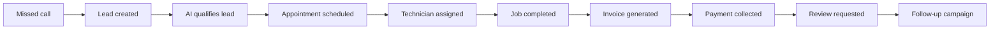
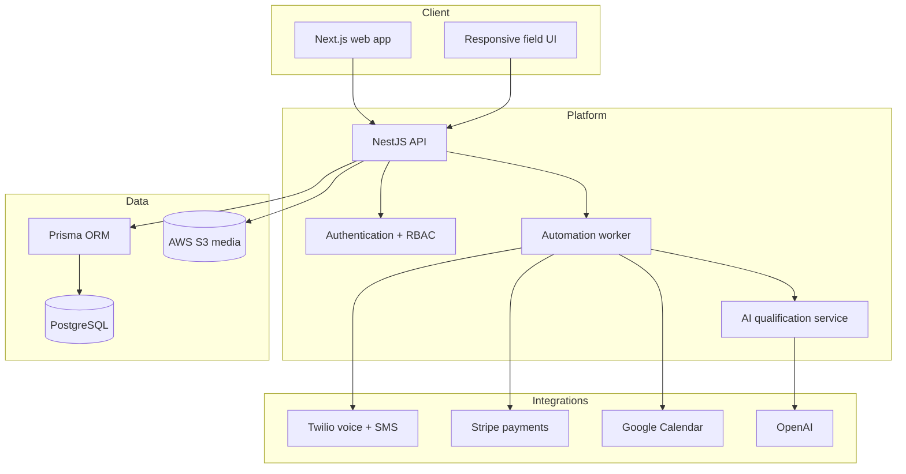
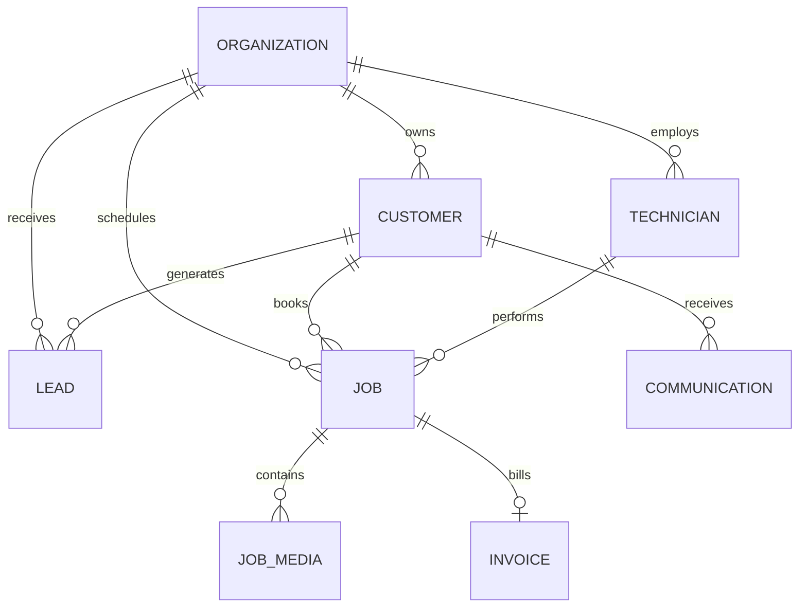
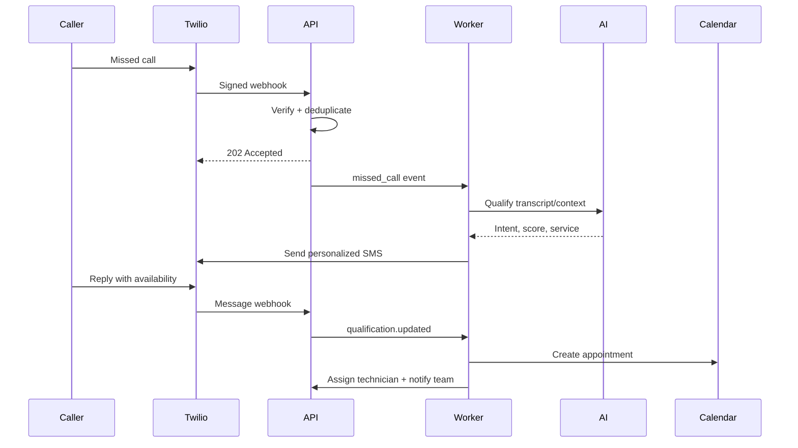

# HomeServe OS

**The customer lifecycle operating system for home-service businesses.**

[Architecture](#architecture) · [API](#api-surface) · [Local setup](#local-development)

HomeServe OS is a multi-tenant SaaS platform for plumbers, HVAC companies, electricians, contractors, cleaners, landscapers, and other field-service teams. It connects lead capture, AI qualification, scheduling, dispatch, job execution, invoicing, payments, reputation, and follow-up automation in one calm workspace.

> Portfolio project: the interface is a fully interactive product demo. The repository also contains a production-oriented NestJS/Prisma backend foundation and infrastructure configuration; third-party integrations require your own credentials.

## Product workflow



## Highlights

- **Customer 360** — contact details, property history, calls, messages, jobs, invoices, and reviews on one timeline.
- **AI lead desk** — missed-call recovery, lead scoring, service classification, summaries, and suggested replies.
- **Dispatch command center** — availability-aware scheduling, technician assignment, arrival windows, and workload visibility.
- **Field operations** — job statuses, notes, checklists, photos, before/after media, and completion sign-off.
- **Revenue operations** — estimates, invoices, Stripe payment status, aging, and monthly performance.
- **Lifecycle automation** — visible, auditable workflows connecting Twilio, OpenAI, Google Calendar, Stripe, and internal events.
- **Responsive product UI** — desktop operations density with a deliberate mobile experience.

## Architecture



### Monorepo layout

```text
homeserve-os/
├── apps/
│   ├── web/                 # Next.js 16 + TypeScript product experience
│   └── api/                 # NestJS API + Prisma schema
├── .github/workflows/       # CI quality gate
├── docker-compose.yml       # PostgreSQL + API development environment
├── netlify.toml             # Static portfolio deployment
└── README.md
```

## Domain model

The Prisma schema includes organizations, customers, leads, technicians, jobs, job media, invoices, communications, and automation runs. Every customer-facing record is organization-scoped. Core lookup and queue paths have compound indexes.



## Automation design

Automation runs are durable records rather than invisible background actions. Each run stores its trigger, normalized input, output, attempt count, status, and next retry time.



Production retry policy should use exponential backoff with full jitter for transient failures (`408`, `425`, `429`, and `5xx`), respect provider `Retry-After` headers, deduplicate inbound events by provider event ID, and move exhausted runs into an operator-visible dead-letter queue.

## Technology

| Layer | Technology |
|---|---|
| Web | Next.js, React, TypeScript, CSS design system |
| API | NestJS, REST, validation-ready modules |
| Data | PostgreSQL, Prisma |
| AI | OpenAI for qualification, summaries, and drafting |
| Communications | Twilio Voice and SMS |
| Payments | Stripe Payment Intents and webhooks |
| Calendar | Google Calendar API |
| Infrastructure | Docker, AWS-ready services, GitHub Actions |
| Portfolio hosting | Netlify static export |

## API surface

Suggested production endpoints:

```text
POST   /api/v1/webhooks/twilio/calls
POST   /api/v1/webhooks/twilio/messages
POST   /api/v1/webhooks/stripe
GET    /api/v1/customers/:id/timeline
POST   /api/v1/leads/:id/qualify
POST   /api/v1/appointments
PATCH  /api/v1/jobs/:id/status
POST   /api/v1/jobs/:id/media
POST   /api/v1/jobs/:id/complete
POST   /api/v1/invoices
POST   /api/v1/automations/:key/run
GET    /api/v1/health
```

## Security model

- Tenant isolation on every organization-owned query.
- Role-based permissions for owner, dispatcher, sales, technician, and finance roles.
- Signature verification before accepting Twilio and Stripe webhooks.
- Idempotency keys on inbound webhooks, invoices, payments, and automation runs.
- Short-lived object storage URLs for customer and job photos.
- No integration secret is stored in Git; `.env.example` documents only key names.
- Audit records should capture actor, action, resource, before/after state, IP, and timestamp.

## Local development

Requirements: Node.js 22+, pnpm 10+, Docker.

```bash
cp .env.example .env
pnpm install
docker compose up -d postgres
pnpm --filter api exec prisma generate
pnpm --filter api exec prisma migrate dev
pnpm --filter api start:dev
pnpm --filter web dev
```

Open `http://localhost:3000`. The API health endpoint is `http://localhost:4000/api/v1/health`.

## Quality checks

```bash
pnpm typecheck
pnpm lint
pnpm build
pnpm test
```

The GitHub Actions workflow runs the same typecheck, lint, and build gates for pushes and pull requests.

## Production roadmap

1. Authentication, invitations, and organization RBAC.
2. Durable queue with outbox processing and a dead-letter console.
3. Twilio webhook ingestion and two-way message threads.
4. Stripe estimates, Payment Intents, refunds, and reconciliation.
5. Google Calendar two-way sync and conflict handling.
6. S3 presigned uploads with image compression and malware scanning.
7. Technician PWA with offline checklists, location opt-in, and signatures.
8. Route optimization, drive-time estimates, and service territories.
9. AI evaluations for lead score accuracy, policy compliance, and hallucination rate.
10. AWS ECS/RDS deployment with OpenTelemetry, alarms, backups, and disaster recovery.

## License

MIT © 2026 Emmanuel Emirex

